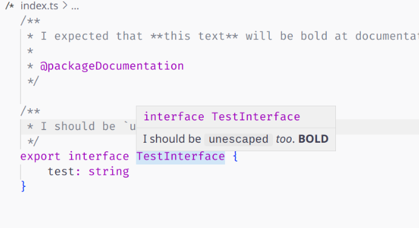
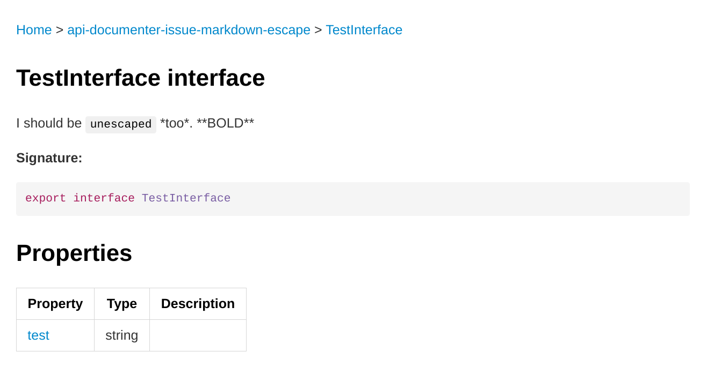

# issue: unexpected markdown escaping

## Expected output markdown

Like in VSCode:



## Actual output

You may look by yourself: [docs/...testinterface.md](./docs/api-documenter-issue-markdown-escape.testinterface.md):



## Install & recompile

> use `pnpm`

```shell
pnpm i
pnpm compile-dts
pnpm api:extract
pnpm api:document
```